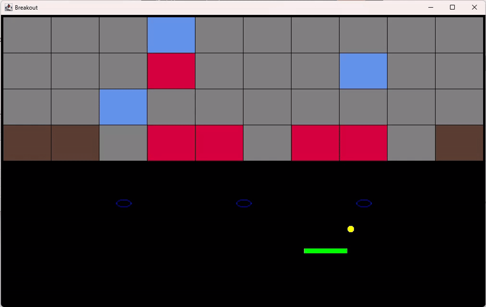

# Breakout Game

The project consists in writing a simple breakout game in the Java programming language.

The goal of Breakout is to move a rectangular paddle around in order to prevent a moving ball (or several) from falling out of bounds. 
This way the ball(s) may continue to destroy blocks that are spread around the game field. 
The game is won when no blocks and at least 1 ball remain. If no balls remain on the field, the game is lost.

This project leverages the following key concepts:
* Employ inheritance and abstract classes (polymorphism)
* Apply defensive programming or contractual programming
* Enforce behavioural subtyping and encapsulation (immutable type)

1 'Brown sturdy blocks' are harder to destruct than normal blocks.

2 'Blue replicator blocks' transform the paddle into a 'replicating paddle' and such a paddle generates extra balls when hit.

3 'Red powerup blocks' transform the balls that touch them into 'supercharged balls'. Such balls can hit and destroy blocks, and conserve their velocity.

4 A fresh 'supercharged ball' has a bigger diameter than a normal ball
  Each time it hits a block, regardless of whether or not it destroys the block, its diameter is reduced by 100.

5 A moving paddle affects the speed of a ball. Balls above the speed threshold are painted red otherwise yellow.

6 The paddle change color when the ball hit blue replicator block.

